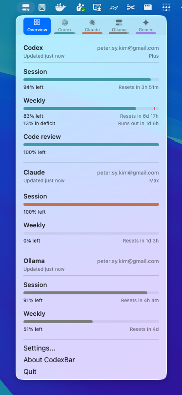

# CodexBar + Ollama 🦙

**What's new:** Added Ollama as a free/low-cost provider to steipete's awesome [CodexBar](https://github.com/steipete/CodexBar) — making AI usage tracking accessible to everyone, not just paid tier users.

Ollama brings self-hosted freedom + cloud fallback to the mix. Session + weekly limits, reset timers, menu bar visibility — all the good stuff.



## Quick Setup

### Cloud Mode (ollama.com)
Free tier: 3-hour session window + weekly quota.

**Pick your auth:**
- 🍪 **Import from Browser** — One-click cookie grab (Safari/Chrome/Firefox)
- 📋 **Manual Paste** — Drop cookie header string, no FDA needed
- ⚙️ **Config Edit** — Tweak `~/.codexbar/config.json` directly

### Local Mode (self-hosted)
Your own Ollama instance at `http://127.0.0.1:11434`. No auth, no limits, just vibes.

---

## Original CodexBar 🎚️

Tiny macOS 14+ menu bar app that keeps your Codex, Claude, Cursor, Gemini, Antigravity, Droid (Factory), Copilot, z.ai, Kiro, Vertex AI, Augment, Amp, JetBrains AI, and OpenRouter limits visible (session + weekly where available) and shows when each window resets. One status item per provider (or Merge Icons mode with a provider switcher and optional Overview tab); enable what you use from Settings. No Dock icon, minimal UI, dynamic bar icons in the menu bar.

## Install

### Requirements
- macOS 14+ (Sonoma)

### Download (Ollama Fork)
**Latest:** [v0.19.0 — Ollama Provider Added](https://github.com/petersykim/CodexBar/releases/tag/v0.19.0)
- Pre-built `.app` with Ollama support
- Free tier + self-hosted modes
- Import from Browser button

### Upstream Releases
Original: <https://github.com/steipete/CodexBar/releases>

### Homebrew
```bash
brew install --cask steipete/tap/codexbar
```

### First run
- Open Settings → Providers and enable what you use.
- Install/sign in to the provider sources you rely on (e.g. `codex`, `claude`, `ollama`, `gemini`, browser cookies, or OAuth; Antigravity requires the Antigravity app running).

## Providers

- **[Ollama](docs/ollama.md)** — Free tier cloud + self-hosted local API. Session (3hr) + weekly (7d) windows.
- [Codex](docs/codex.md) — Local Codex CLI RPC (+ PTY fallback) and optional OpenAI web dashboard extras.
- [Claude](docs/claude.md) — OAuth API or browser cookies (+ CLI PTY fallback); session + weekly usage.
- [Cursor](docs/cursor.md) — Browser session cookies for plan + usage + billing resets.
- [Gemini](docs/gemini.md) — OAuth-backed quota API using Gemini CLI credentials (no browser cookies).
- [Antigravity](docs/antigravity.md) — Local language server probe (experimental); no external auth.
- [Droid](docs/factory.md) — Browser cookies + WorkOS token flows for Factory usage + billing.
- [Copilot](docs/copilot.md) — GitHub device flow + Copilot internal usage API.
- [z.ai](docs/zai.md) — API token (Keychain) for quota + MCP windows.
- [Kimi](docs/kimi.md) — Auth token (JWT from `kimi-auth` cookie) for weekly quota + 5‑hour rate limit.
- [Kimi K2](docs/kimi-k2.md) — API key for credit-based usage totals.
- [Kiro](docs/kiro.md) — CLI-based usage via `kiro-cli /usage` command; monthly credits + bonus credits.
- [Vertex AI](docs/vertexai.md) — Google Cloud gcloud OAuth with token cost tracking from local Claude logs.
- [Augment](docs/augment.md) — Browser cookie-based authentication with automatic session keepalive; credits tracking and usage monitoring.
- [Amp](docs/amp.md) — Browser cookie-based authentication with Amp Free usage tracking.
- [JetBrains AI](docs/jetbrains.md) — Local XML-based quota from JetBrains IDE configuration; monthly credits tracking.
- [OpenRouter](docs/openrouter.md) — API token for credit-based usage tracking across multiple AI providers.

## Features
- Multi-provider menu bar with per-provider toggles (Settings → Providers).
- Session + weekly meters with reset countdowns.
- Optional Codex web dashboard enrichments (code review remaining, usage breakdown, credits history).
- Local cost-usage scan for Codex + Claude (last 30 days).
- Provider status polling with incident badges in the menu and icon overlay.
- Merge Icons mode to combine providers into one status item + switcher, with an optional Overview tab for up to three providers.
- Refresh cadence presets (manual, 1m, 2m, 5m, 15m).
- Bundled CLI (`codexbar`) for scripts and CI.
- WidgetKit widget mirrors the menu card snapshot.
- Privacy-first: on-device parsing by default; browser cookies are opt-in and reused (no passwords stored).

## macOS permissions
- **Full Disk Access**: For browser cookie import (Safari/Chrome/Firefox). Skip if using manual paste or local Ollama.
- **Keychain**: Chrome cookie decryption, OAuth credentials, API tokens.

---

**Original by:** [steipete](https://github.com/steipete/CameBar)  
**Ollama fork:** [petersykim/CameBar](https://github.com/petersykim/CameBar)
